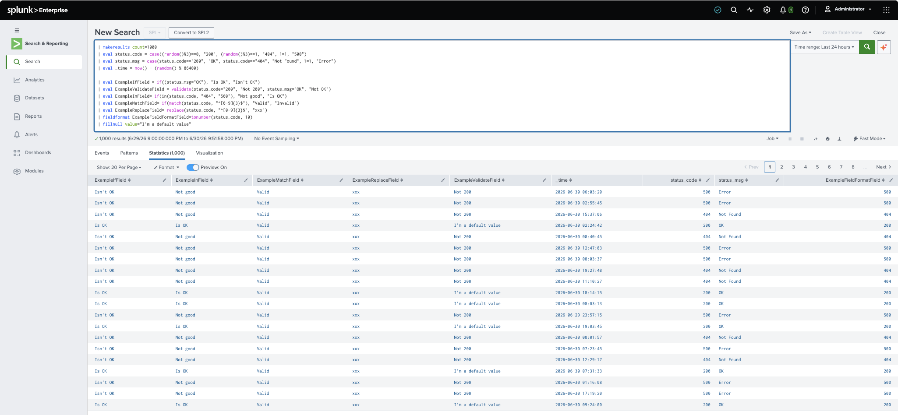

# Core Certified Power User - Topic Five: Comparing Values

```splunk
| makeresults count=1000 
| eval status_code = case((random()%3)==0, "200", (random()%3)==1, "404", 1=1, "500")
| eval status_msg = case(status_code=="200", "OK", status_code=="404", "Not Found", 1=1, "Error")
| eval _time = now() - (random() % 86400)

| eval ExampleIfField = if((status_msg="OK"), "Is OK", "Isn't OK")
| eval ExampleValidateField = validate(status_code="200", "Not 200", status_msg="OK", "Not OK")
| eval ExampleInField= if(in(status_code, "404", "500"), "Not good", "Is OK")
| eval ExampleMatchField= if(match(status_code, "^[0-9]{3}$"), "Valid", "Invalid")
| eval ExampleReplaceField= replace(status_code, "^[0-9]{3}$", "xxx")
| fieldformat ExampleFieldFormatField=tonumber(status_code, 10)
| fillnull value="I'm a default value"
```



* `fillnull` will fill any `NULL` value with the specified `value`.