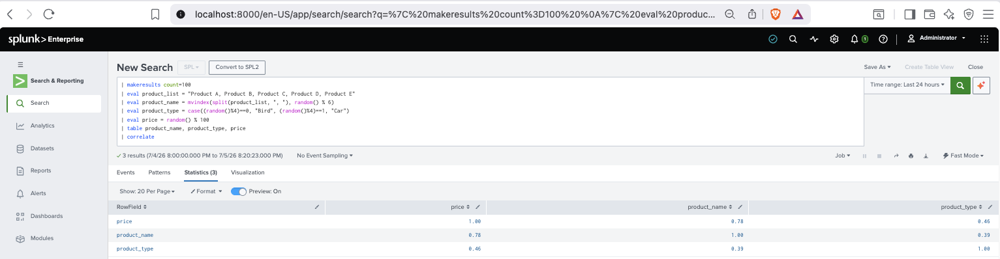
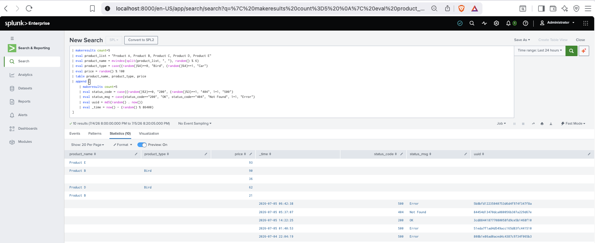
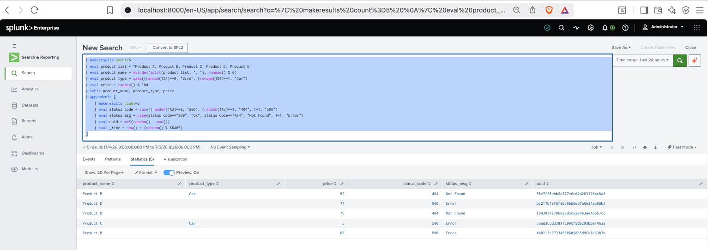
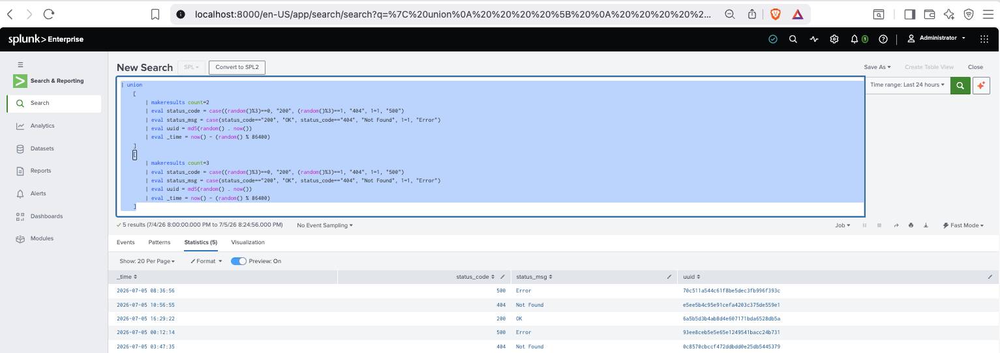

# Core Certified Power User - Topic Seven: Correlation Analysis

## correlate

```splunk
| makeresults count=100 
| eval product_list = "Product A, Product B, Product C, Product D, Product E"
| eval product_name = mvindex(split(product_list, ", "), random() % 6)
| eval product_type = case((random()%4)==0, "Bird", (random()%4)==1, "Car")
| eval price = random() % 100
| table product_name, product_type, price
| correlate
```



## append

```splunk
| makeresults count=5 
| eval product_list = "Product A, Product B, Product C, Product D, Product E"
| eval product_name = mvindex(split(product_list, ", "), random() % 6)
| eval product_type = case((random()%4)==0, "Bird", (random()%4)==1, "Car")
| eval price = random() % 100
| table product_name, product_type, price
| append [
    | makeresults count=5 
    | eval status_code = case((random()%3)==0, "200", (random()%3)==1, "404", 1=1, "500")
    | eval status_msg = case(status_code=="200", "OK", status_code=="404", "Not Found", 1=1, "Error")
    | eval uuid = md5(random() . now()) 
    | eval _time = now() - (random() % 86400)
]
```



* Appends the results of one query below another.

## appendcols

```splunk
| makeresults count=5 
| eval product_list = "Product A, Product B, Product C, Product D, Product E"
| eval product_name = mvindex(split(product_list, ", "), random() % 6)
| eval product_type = case((random()%4)==0, "Bird", (random()%4)==1, "Car")
| eval price = random() % 100
| table product_name, product_type, price
| appendcols [
    | makeresults count=5 
    | eval status_code = case((random()%3)==0, "200", (random()%3)==1, "404", 1=1, "500")
    | eval status_msg = case(status_code=="200", "OK", status_code=="404", "Not Found", 1=1, "Error")
    | eval uuid = md5(random() . now()) 
    | eval _time = now() - (random() % 86400)
]
```



* Appends **Fields** from one result to another as a column.

## union

```splunk
| union
    [ 
        | makeresults count=2
        | eval status_code = case((random()%3)==0, "200", (random()%3)==1, "404", 1=1, "500")
        | eval status_msg = case(status_code=="200", "OK", status_code=="404", "Not Found", 1=1, "Error")
        | eval uuid = md5(random() . now()) 
        | eval _time = now() - (random() % 86400)
    ]
    [ 
        | makeresults count=3 
        | eval status_code = case((random()%3)==0, "200", (random()%3)==1, "404", 1=1, "500")
        | eval status_msg = case(status_code=="200", "OK", status_code=="404", "Not Found", 1=1, "Error")
        | eval uuid = md5(random() . now()) 
        | eval _time = now() - (random() % 86400)
    ]
```



* Merges results.