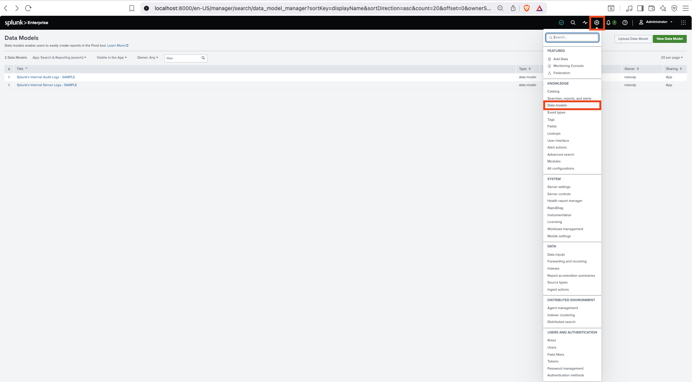
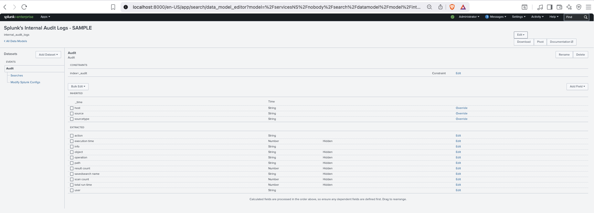
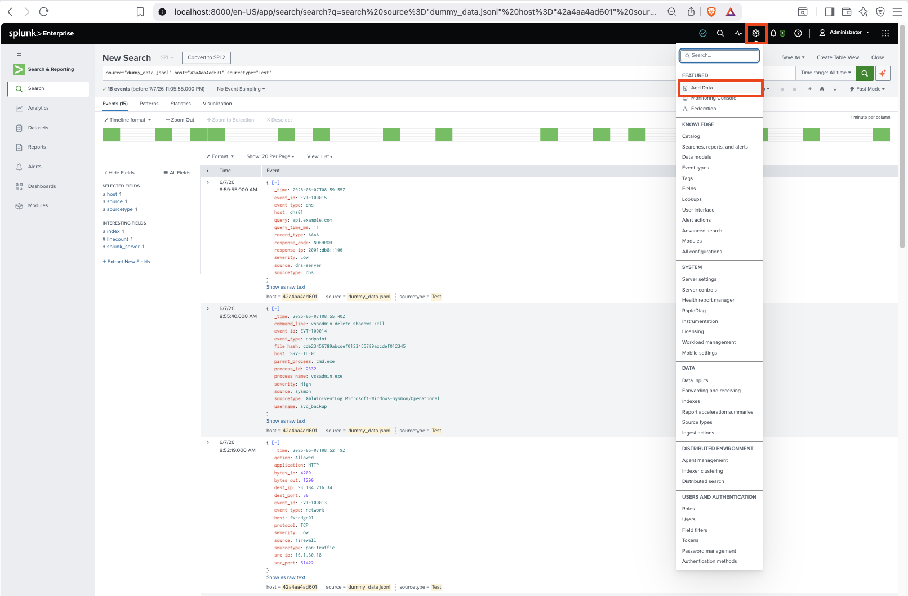
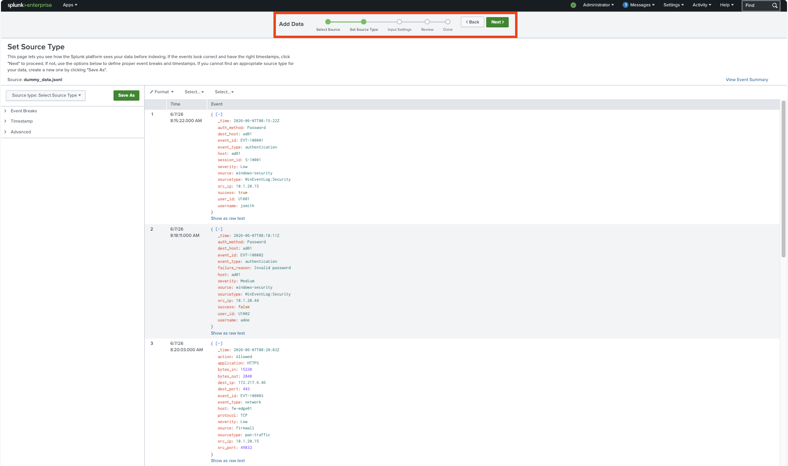

# Core Certified Power User - Topic Eleven:  Data Models

## Data Models and Data Model Datasets

To upload **Data Model Metadata**:





## Uploading Data

To upload data for ingestion, indexing, and searching:





```splunk
source="dummy_data.jsonl" host="42a4aa4ad601" sourcetype="Test"
```

* Add `.jsonl`, `.csv`, and other files through **Settings** > **Add data** in the Splunk UI/UX.