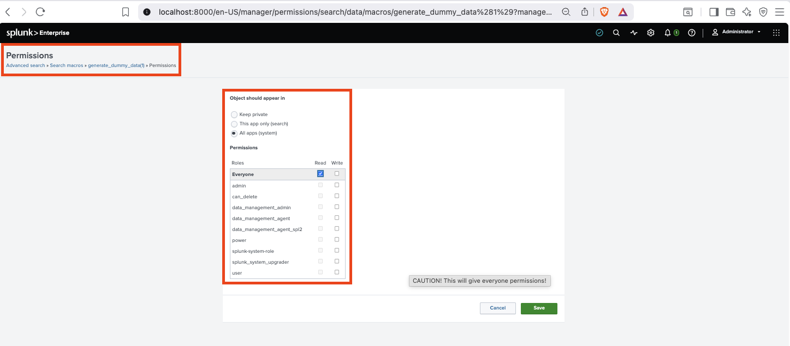
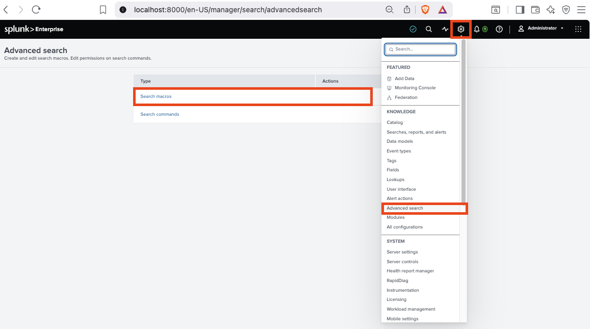
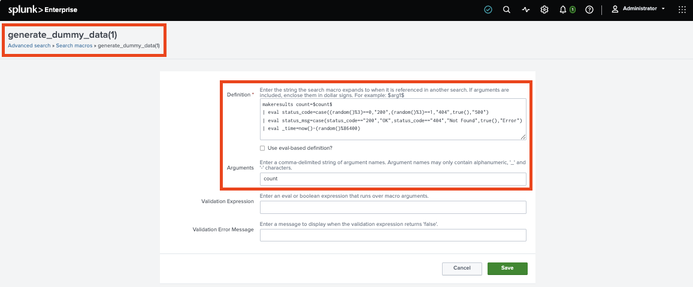
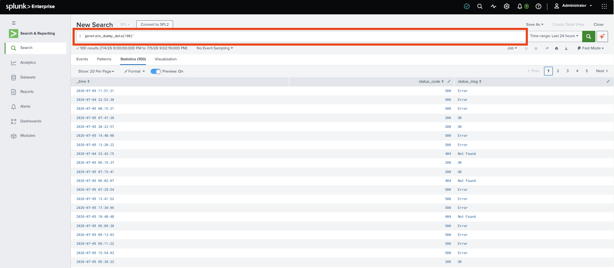
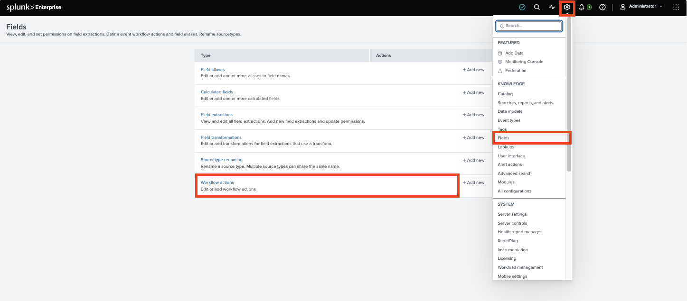

# Core Certified Power User - Topic Seven: Knowledge Objects

## Roles and Permissions

1. The `Admin` User Role is required to make a **Knowledge Object** available to all **Apps**.
1. `User`, `Power`, `Admin` (in ascending order) can create **Knowledge Objects** to varying extents (as allowed by their permissions).
1. Default sharing options (in ascending order of visibility):
    * `Private` - Shared/Accessible only for creator User (`READ`, `WRITE`).
    * `App` - Shared/Accessible by all Users in same App (`READ`, `WRITE`depending on Role specifics)
    * `Global/All Apps` - Accessible by all the Users of all deployed Splunk Apps (`READ`, `WRITE` depending on Role specifics).



## macros

Defined within the **Settings** > **Advanced search** > **Search macros** UI/UX Component.



Example definition:

```splunk
makeresults count=$count$
| eval status_code=case((random()%3)==0,"200",(random()%3)==1,"404",true(),"500")
| eval status_msg=case(status_code=="200","OK",status_code=="404","Not Found",true(),"Error")
| eval _time=now()-(random()%86400)
```



Example use:

```splunk
| `generate_dummy_data(100)`
```



## Workflow Actions

Defined within the **Settings** > **Fields** > **Workflow actions** UI/UX Component.


