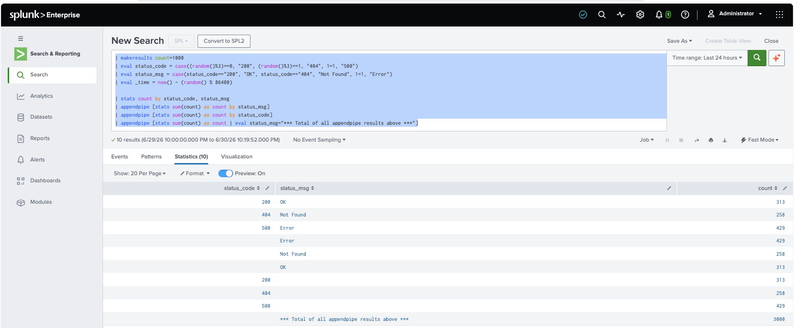
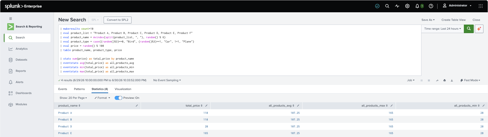
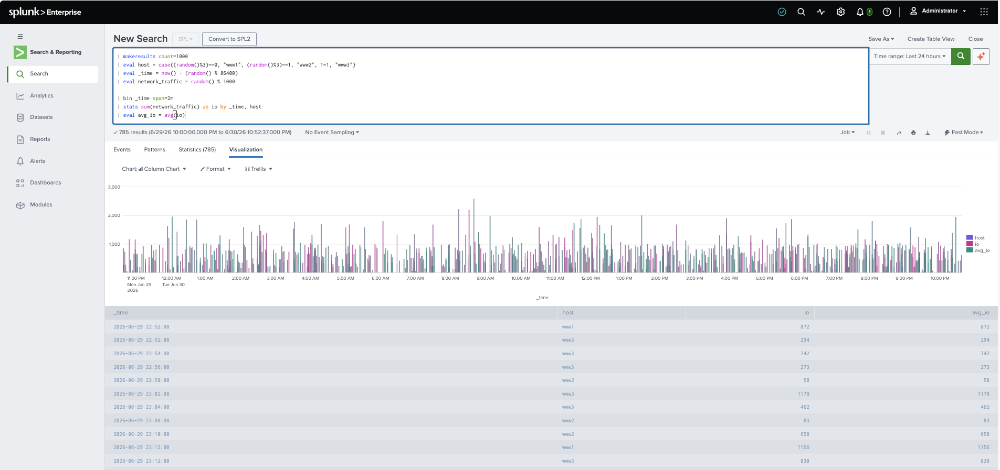
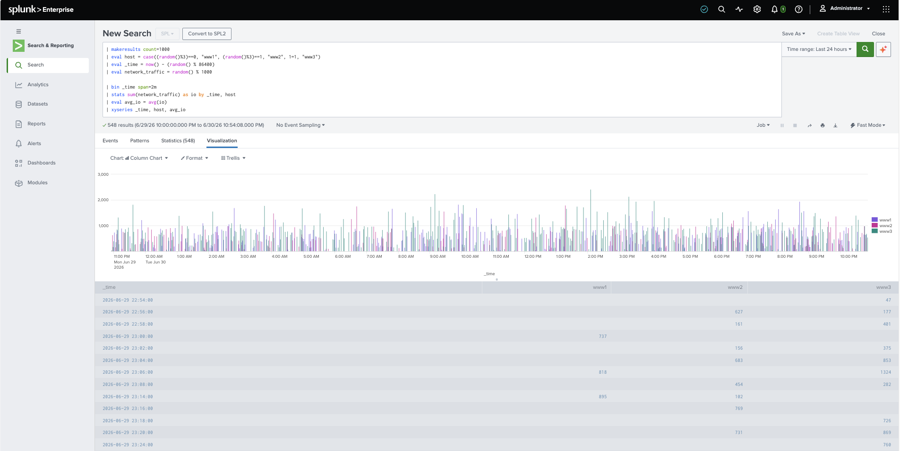
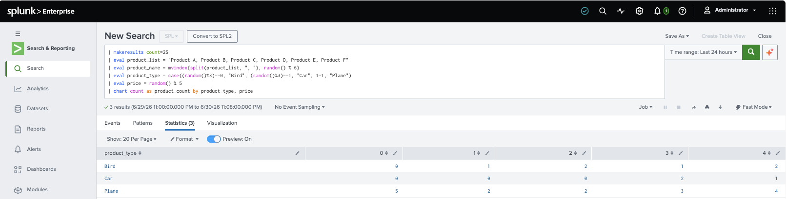
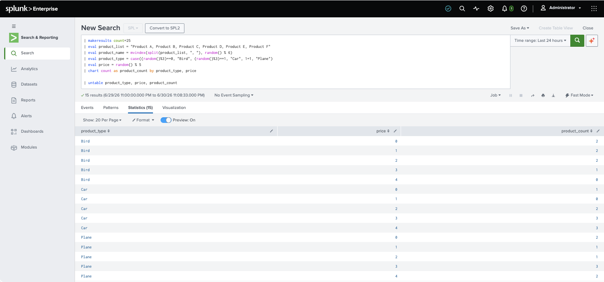
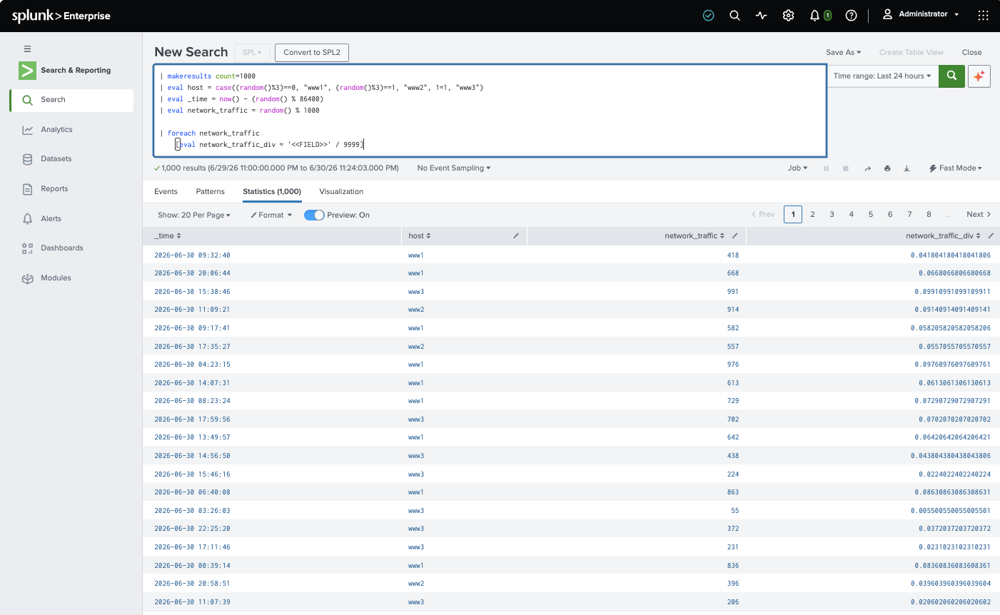

# Core Certified Power User - Topic Six: Result Modification

## appendpipe

```splunk
| makeresults count=1000 
| eval status_code = case((random()%3)==0, "200", (random()%3)==1, "404", 1=1, "500")
| eval status_msg = case(status_code=="200", "OK", status_code=="404", "Not Found", 1=1, "Error")
| eval _time = now() - (random() % 86400)

| stats count by status_code, status_msg
| appendpipe [stats sum(count) as count by status_msg]
| appendpipe [stats sum(count) as count by status_code]
| appendpipe [stats sum(count) as count | eval status_msg="*** Total of all appendpipe results above ***"]
```



* `appendpipe` appends a **Field** to the very bottom (adding a right-most, last **Field**) to the preceding result.
* If the same **Field** name is aliased, it'll combine the new **Field** with an existing one, merely appending the new results to the end (and not adding a new **Field**).

## eventstats

```splunk
| makeresults count=10 
| eval product_list = "Product A, Product B, Product C, Product D, Product E, Product F"
| eval product_name = mvindex(split(product_list, ", "), random() % 6)
| eval product_type = case((random()%3)==0, "Bird", (random()%3)==1, "Car", 1=1, "Plane")
| eval price = random() % 100
| table product_name, product_type, price

| stats sum(price) as total_price by product_name
| eventstats avg(total_price) as all_products_avg
| eventstats min(total_price) as all_products_min
| eventstats max(total_price) as all_products_max
```



* Similar to `appendpipe`, `eventstats` adds a **Field** but to the existing **Table** (and hence, to each row).

## streamstats

A realtime, streaming, `eventstats` variant (with nearly the same syntax and **Function** support).

## xyseries

Introducing `xyseries` by comparison:

```splunk
| makeresults count=1000 
| eval host = case((random()%3)==0, "www1", (random()%3)==1, "www2", 1=1, "www3")
| eval _time = now() - (random() % 86400)
| eval network_traffic = random() % 1000

| bin _time span=2m
| stats sum(network_traffic) as io by _time, host
| eval avg_io = avg(io)
```



* The example above generates `bins` (`_time`) each with `avg_io`, `io`, and the many `host` **Fields**. It's `bin` (`_time`)-centric.

```splunk
| makeresults count=1000 
| eval host = case((random()%3)==0, "www1", (random()%3)==1, "www2", 1=1, "www3")
| eval _time = now() - (random() % 86400)
| eval network_traffic = random() % 1000

| bin _time span=2m
| stats sum(network_traffic) as io by _time, host
| eval avg_io = avg(io)
| xyseries _time, host, avg_io
```



* By using `xyseries`, the prior example is reformatted to emphasize the relationship of `bin` (`_time`) to `host`. `avg_io` is moved into the y-axis.

## untable

Compare:

```splunk
| makeresults count=25 
| eval product_list = "Product A, Product B, Product C, Product D, Product E, Product F"
| eval product_name = mvindex(split(product_list, ", "), random() % 6)
| eval product_type = case((random()%3)==0, "Bird", (random()%3)==1, "Car", 1=1, "Plane")
| eval price = random() % 100
| chart count as product_count by product_type, price
```



* In the example above, `chart` takes the `product_type` **Field** as the y-axis and `prices` as the x-axis (filling in `product_count` in each cell). 

```splunk
| makeresults count=25 
| eval product_list = "Product A, Product B, Product C, Product D, Product E, Product F"
| eval product_name = mvindex(split(product_list, ", "), random() % 6)
| eval product_type = case((random()%3)==0, "Bird", (random()%3)==1, "Car", 1=1, "Plane")
| eval price = random() % 5
| chart count as product_count by product_type, price

| untable product_type, price, product_count
```



* Using `untable`, we transform/rotate the prior format so that `product_type` is the left-most **Field** (y-axis) with `product_counts` for each `price` for each `product_type` displayed instead.

## foreach

```splunk
| makeresults count=1000 
| eval host = case((random()%3)==0, "www1", (random()%3)==1, "www2", 1=1, "www3")
| eval _time = now() - (random() % 86400)
| eval network_traffic = random() % 1000

| foreach network_traffic
    [eval network_traffic_div = '<<FIELD>>' / 9999]
```



* `foreach` is typically supplied a list of whitespace-delimitted **Fields**. For each **Field** in that list (indicated using `'<<FIELD>>'` syntax) a specifed Command is applied.
* Above, instead of using another `eval` or `eventstats` Command, `foreach` computes a specified ratio adding it as a **Field** value under a new **Field** name.
