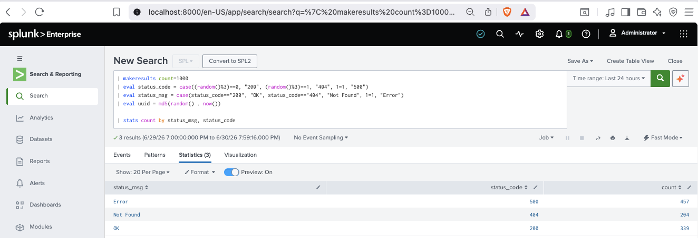
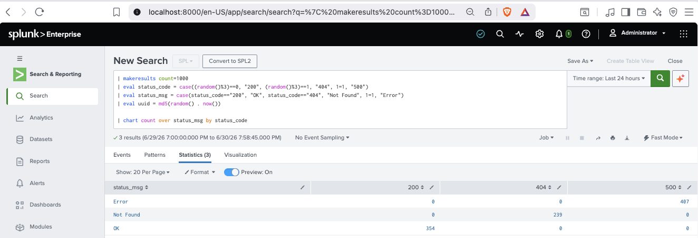
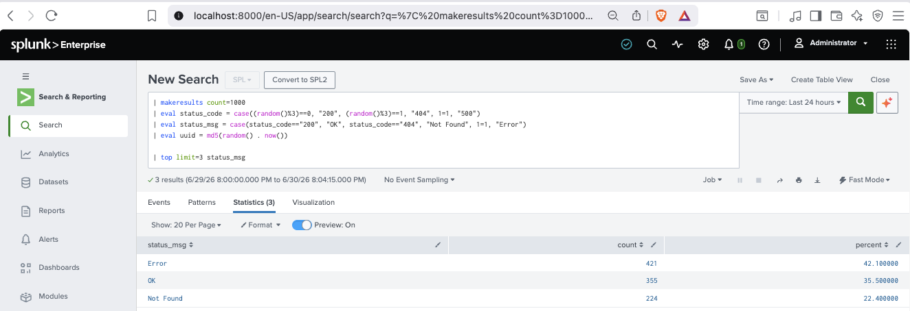
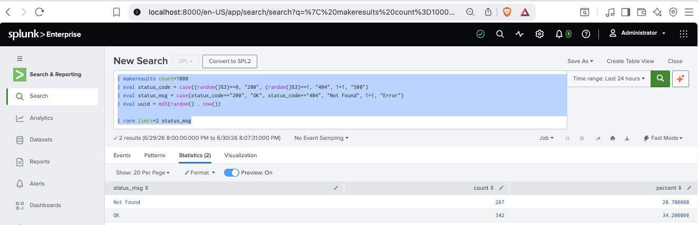
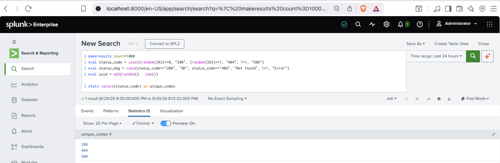
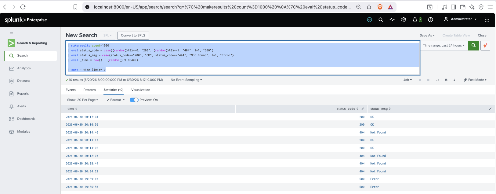

# Core Certified Power User - Topic Four: Statistical Processing

## stats

```splunk
| makeresults count=1000 
| eval status_code = case((random()%3)==0, "200", (random()%3)==1, "404", 1=1, "500")
| eval status_msg = case(status_code=="200", "OK", status_code=="404", "Not Found", 1=1, "Error")
| eval uuid = md5(random() . now())

| stats count by status_msg, status_code
```



* Multiple **Fields** can be returned with `by`.

## Chart

```splunk
| makeresults count=1000 
| eval status_code = case((random()%3)==0, "200", (random()%3)==1, "404", 1=1, "500")
| eval status_msg = case(status_code=="200", "OK", status_code=="404", "Not Found", 1=1, "Error")
| eval uuid = md5(random() . now())

| chart count over status_msg by status_code
```



* Similar to `stats` but narrowed to summarize exactly one or two **Fields**.
* `over` and `by` will typically produce the same result when using `chart`.

## Timechart

Review: [Topic Three: Time](CCPU-Time.md)

## Top

```splunk
| makeresults count=1000 
| eval status_code = case((random()%3)==0, "200", (random()%3)==1, "404", 1=1, "500")
| eval status_msg = case(status_code=="200", "OK", status_code=="404", "Not Found", 1=1, "Error")
| eval uuid = md5(random() . now())

| top limit=3 status_msg
```



* Returns the top *n* (`limit=n`) most common results for a **Field**.

## Rare

```splunk
| makeresults count=1000 
| eval status_code = case((random()%3)==0, "200", (random()%3)==1, "404", 1=1, "500")
| eval status_msg = case(status_code=="200", "OK", status_code=="404", "Not Found", 1=1, "Error")
| eval uuid = md5(random() . now())

| rare limit=2 status_msg
```



* Essentially the opposite of the `top` Command.
* Returns the *n* (`limit=n`) least common results for a **Field**.

## Stats Functions

```splunk
| makeresults count=1000 
| eval status_code = case((random()%3)==0, "200", (random()%3)==1, "404", 1=1, "500")
| eval status_msg = case(status_code=="200", "OK", status_code=="404", "Not Found", 1=1, "Error")
| eval uuid = md5(random() . now())

| stats values(status_code) as unique_codes 
```



* **Functions** that are evaluated within a `stats` clause.

## Eval

```splunk
| makeresults count=1000 
| eval status_code = case((random()%3)==0, "200", (random()%3)==1, "404", 1=1, "500")
| eval status_msg = case(status_code=="200", "OK", status_code=="404", "Not Found", 1=1, "Error")
| eval uuid = md5(random() . now())
```

## Sort

```splunk
| makeresults count=1000 
| eval status_code = case((random()%3)==0, "200", (random()%3)==1, "404", 1=1, "500")
| eval status_msg = case(status_code=="200", "OK", status_code=="404", "Not Found", 1=1, "Error")
| eval _time = now() - (random() % 86400)

| sort -_time limit=10s
```



* Sort results by a specified **Field** (using prefixed `-` for descending sort).