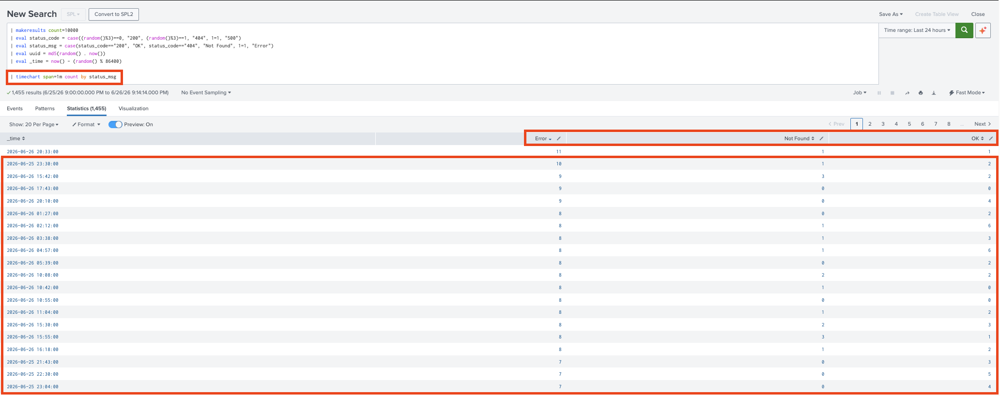
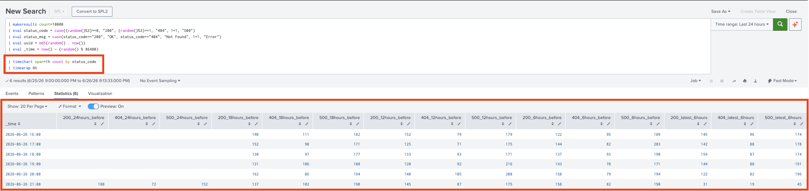

# Core Certified Power User - Topic Three: Time

Simple example that generates fake data through `makeresults` and then demonstrates `timechart` and `timewrap`.

```splunk
| makeresults count=10000 
| eval status_code = case((random()%3)==0, "200", (random()%3)==1, "404", 1=1, "500")
| eval status_msg = case(status_code=="200", "OK", status_code=="404", "Not Found", 1=1, "Error")
| eval uuid = md5(random() . now()) 
| eval _time = now() - (random() % 86400)

| timechart span=1m count by status_msg
```



> `timechart` maps counts to spans.

```splunk
| makeresults count=10000 
| eval status_code = case((random()%3)==0, "200", (random()%3)==1, "404", 1=1, "500")
| eval status_msg = case(status_code=="200", "OK", status_code=="404", "Not Found", 1=1, "Error")
| eval uuid = md5(random() . now()) 
| eval _time = now() - (random() % 86400)

| timechart span=1h count by status_code
| timewrap 6h
```



> `timewrap` splits data by intervals summing spans that fall within them.

In both cases, `_time` values are explicitly and randomly generated to populate more reasonable distributions of data.
* By default, Splunk will assign the time the Event is Indexed if no `_time` value is found. Since all Events are Indexed around the same time, the resultant data mostly generates `0` counts if `_time` *isn't* explicitly and randomly defined in a manner like that above.

## Earliest, Latest

The following query use use `latest`, `earliest`, and Time Units which are only supported in Queryies preceding a `makeresults` expression. As such, no result will display (either when this run solitarily or when appended to one of the other Queries):

```splunk
search status_msg="OK" earliest=-30d@d latest=@d
```

Important items here: **Time Units** and **Snapping**.

**Time Units**:
* Minute: `@m` or `@min`
* Hour: `@h`
* Day: `@d`
* Week: `@w` or `@week` (snaps to Monday)
* Specific day: `@w0` (Sunday) through `@w6` (Saturday)
* Month: `@mon` or `@month`
* Year: `@y` or `@year`

How **Snap Rounding** works:
* The expression: `earliest=-30d@d latest=@d` snaps to the first, complete **30 Days** preceeding and the `latest` **Day** (rounded down). 

