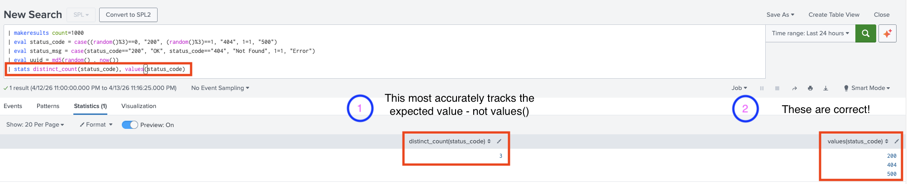
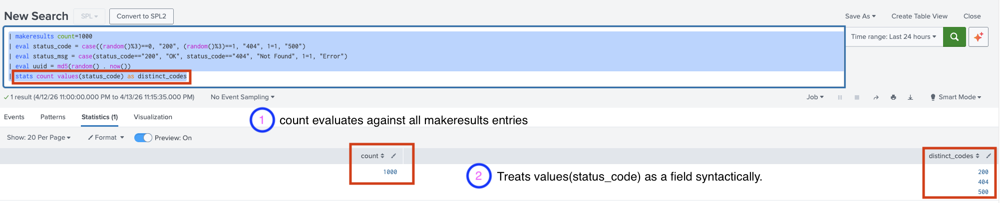
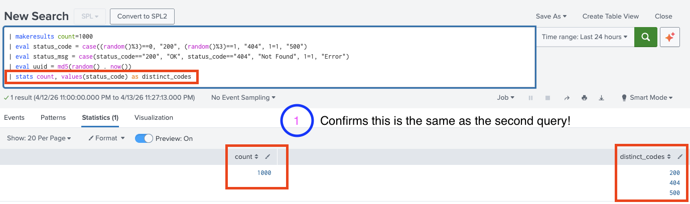
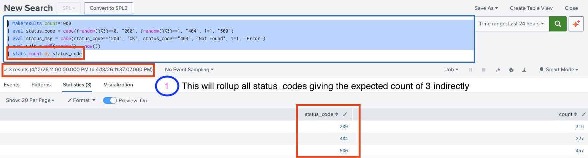
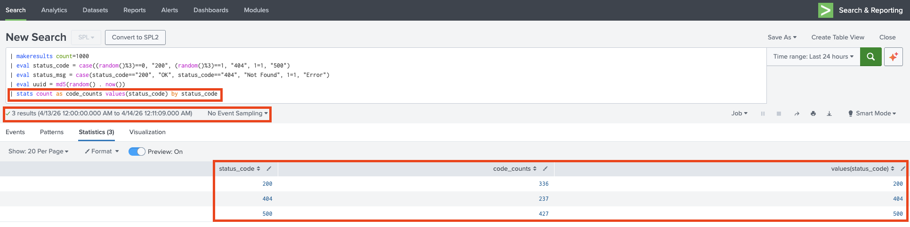
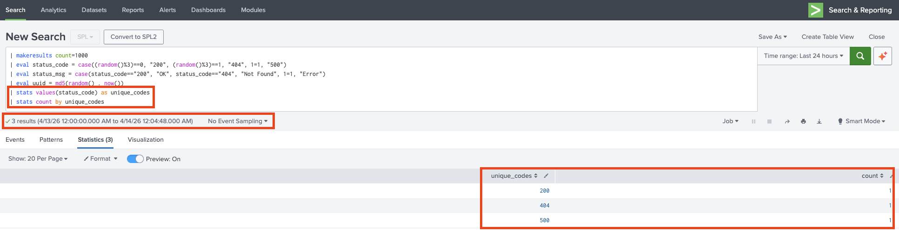
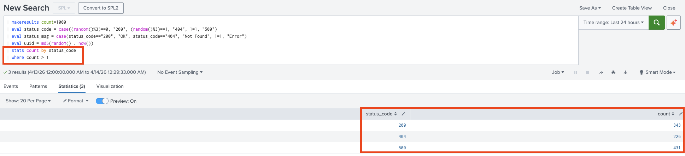

# Verifying Count Values()

> I guess I did something like this post: https://community.splunk.com/t5/Splunk-Search/Stats-Values-and-Count/m-p/305743

Comparing `distinct_count()` vs. `stats count values()`:

```splunk
| makeresults count=1000 
| eval status_code = case((random()%3)==0, "200", (random()%3)==1, "404", 1=1, "500")
| eval status_msg = case(status_code=="200", "OK", status_code=="404", "Not Found", 1=1, "Error")
| eval uuid = md5(random() . now())
| stats distinct_count(status_code), values(status_code)
```



```splunk
| makeresults count=1000 
| eval status_code = case((random()%3)==0, "200", (random()%3)==1, "404", 1=1, "500")
| eval status_msg = case(status_code=="200", "OK", status_code=="404", "Not Found", 1=1, "Error")
| eval uuid = md5(random() . now())
| stats count values(status_code) as distinct_codes
```



> So, I should keep using `distinct_count()` and not `count values` - syntatically, `stats count, values(status_code) as distinct_codes` and `stats count values(status_code) as distinct_codes`.

And indeed they are!

```splunk
| makeresults count=1000 
| eval status_code = case((random()%3)==0, "200", (random()%3)==1, "404", 1=1, "500")
| eval status_msg = case(status_code=="200", "OK", status_code=="404", "Not Found", 1=1, "Error")
| eval uuid = md5(random() . now())
| stats count, values(status_code) as distinct_codes
```



Also:
```splunk
| makeresults count=1000 
| eval status_code = case((random()%3)==0, "200", (random()%3)==1, "404", 1=1, "500")
| eval status_msg = case(status_code=="200", "OK", status_code=="404", "Not Found", 1=1, "Error")
| eval uuid = md5(random() . now())
| stats count by status_code
```


This also returns the correct count of `3` with `stats count as ... by`:

```splunk
| makeresults count=1000 
| eval status_code = case((random()%3)==0, "200", (random()%3)==1, "404", 1=1, "500")
| eval status_msg = case(status_code=="200", "OK", status_code=="404", "Not Found", 1=1, "Error")
| eval uuid = md5(random() . now())
| stats count as code_counts values(status_code) by status_code
```



As does this one:

```splunk
| makeresults count=1000 
| eval status_code = case((random()%3)==0, "200", (random()%3)==1, "404", 1=1, "500")
| eval status_msg = case(status_code=="200", "OK", status_code=="404", "Not Found", 1=1, "Error")
| eval uuid = md5(random() . now())
| stats values(status_code) as unique_codes 
| stats count by unique_codes
```



**Note:** the following will ***NOT*** give the desired count of `3`:

```splunk
| makeresults count=1000 
| eval status_code = case((random()%3)==0, "200", (random()%3)==1, "404", 1=1, "500")
| eval status_msg = case(status_code=="200", "OK", status_code=="404", "Not Found", 1=1, "Error")
| eval uuid = md5(random() . now())
| stats values(status_code) as unique_codes
```


## Non-Uniqueness

Of counts not of values in `values()`.

Basic query to find entries with ***no entries*** associated:
```splunk
| makeresults count=1000 
| eval status_code = case((random()%3)==0, "200", (random()%3)==1, "404", 1=1, "500")
| eval status_msg = case(status_code=="200", "OK", status_code=="404", "Not Found", 1=1, "Error")
| eval uuid = md5(random() . now())
| stats count by status_code 
| where count = 0
```
With ***exactly one*** entry associated:
```splunk
| makeresults count=1000 
| eval status_code = case((random()%3)==0, "200", (random()%3)==1, "404", 1=1, "500")
| eval status_msg = case(status_code=="200", "OK", status_code=="404", "Not Found", 1=1, "Error")
| eval uuid = md5(random() . now())
| stats count by status_code 
| where count = 1
```

> Hey, the complement of the above.

Basic query to find entries with ***more than one*** entry associated:
```splunk
| makeresults count=1000 
| eval status_code = case((random()%3)==0, "200", (random()%3)==1, "404", 1=1, "500")
| eval status_msg = case(status_code=="200", "OK", status_code=="404", "Not Found", 1=1, "Error")
| eval uuid = md5(random() . now())
| stats count by status_code
| where count > 1
```

