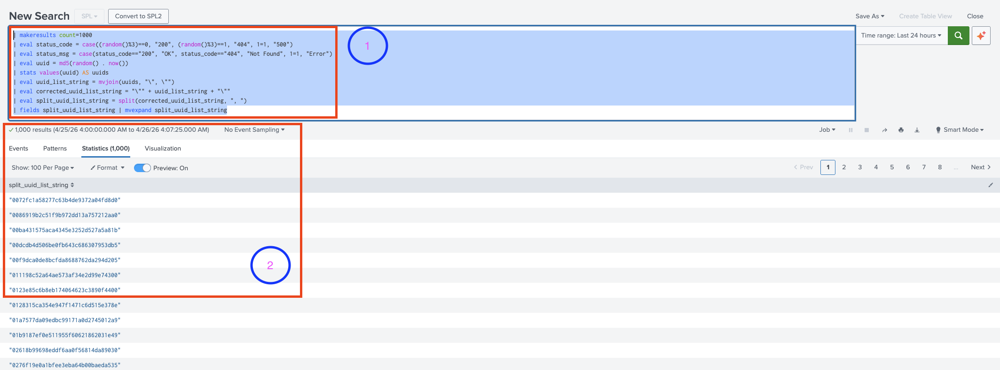

# Split and mvexpand

Unique, deduplicated, `uuid` that are first Concatenated, Split, then Expanded into individual Rows:

```splunk
| makeresults count=1000 
| eval status_code = case((random()%3)==0, "200", (random()%3)==1, "404", 1=1, "500")
| eval status_msg = case(status_code=="200", "OK", status_code=="404", "Not Found", 1=1, "Error")
| eval uuid = md5(random() . now()) 
| stats values(uuid) AS uuids 
| eval uuid_list_string = mvjoin(uuids, "\", \"") 
| eval corrected_uuid_list_string = "\"" + uuid_list_string + "\"" 
| eval split_uuid_list_string = split(corrected_uuid_list_string, ", ")
| fields split_uuid_list_string 
| mvexpand split_uuid_list_string
```

