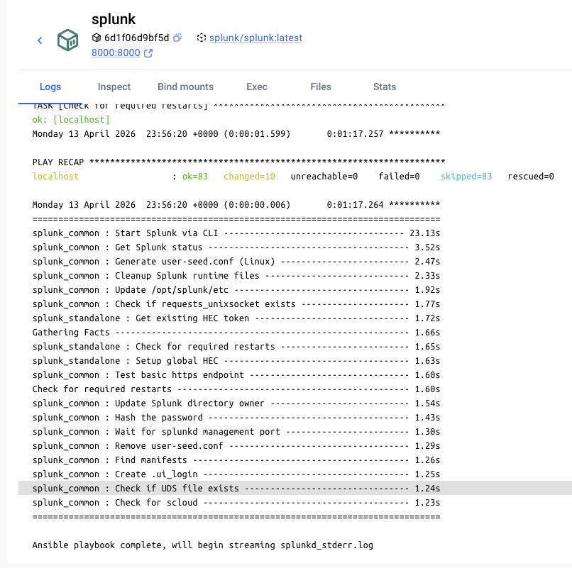
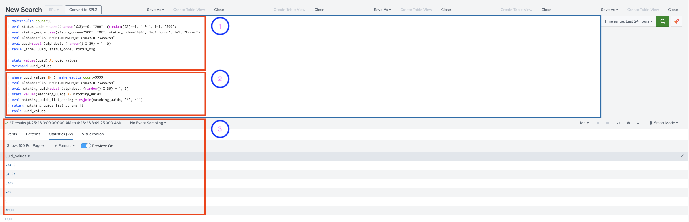

# Splunk_2026


Review of some basics.

## Setup

```bash
$ docker run --platform linux/amd64 -d -p 8000:8000 -e "SPLUNK_START_ARGS=--accept-license" -e "SPLUNK_GENERAL_TERMS=--accept-sgt-current-at-splunk-com" -e "SPLUNK_PASSWORD=mypassword" --name splunk splunk/splunk:latest
```

1. Splunk doesn't release Apple ARM native distros. Use the `--platform linux/amd64` for Rosetta compatibility.
1. The above command will spin up an instance without having to pass the `-it --name so1 splunk/splunk:latest` flag.
1. [localhost:8000](http://localhost:8000/en-US/app/search/search) with login `admin` and `mypassword`.

    * It can take a moment for the Splunk instance to get up and running:

      

## Queries

### Verifying Count Values()

> I guess I did something like this post: https://community.splunk.com/t5/Splunk-Search/Stats-Values-and-Count/m-p/305743

Comparing `distinct_count()` vs. `stats count values()`:

```splunk
| makeresults count=1000 
| eval status_code = case((random()%3)==0, "200", (random()%3)==1, "404", 1=1, "500")
| eval status_msg = case(status_code=="200", "OK", status_code=="404", "Not Found", 1=1, "Error")
| eval uuid = md5(random() . now())
| stats distinct_count(status_code), values(status_code)
```


```splunk
| makeresults count=1000 
| eval status_code = case((random()%3)==0, "200", (random()%3)==1, "404", 1=1, "500")
| eval status_msg = case(status_code=="200", "OK", status_code=="404", "Not Found", 1=1, "Error")
| eval uuid = md5(random() . now())
| stats count values(status_code) as distinct_codes
```


> So, I should keep using `distinct_count()` and not `count values` - syntatically, `stats count, values(status_code) as distinct_codes` and `stats count values(status_code) as distinct_codes`.

And indeed they are!

```splunk
| makeresults count=1000 
| eval status_code = case((random()%3)==0, "200", (random()%3)==1, "404", 1=1, "500")
| eval status_msg = case(status_code=="200", "OK", status_code=="404", "Not Found", 1=1, "Error")
| eval uuid = md5(random() . now())
| stats count, values(status_code) as distinct_codes
```


Also:
```splunk
| makeresults count=1000 
| eval status_code = case((random()%3)==0, "200", (random()%3)==1, "404", 1=1, "500")
| eval status_msg = case(status_code=="200", "OK", status_code=="404", "Not Found", 1=1, "Error")
| eval uuid = md5(random() . now())
| stats count by status_code
```


This also returns the correct count of `3` with `stats count as ... by`:

```splunk
| makeresults count=1000 
| eval status_code = case((random()%3)==0, "200", (random()%3)==1, "404", 1=1, "500")
| eval status_msg = case(status_code=="200", "OK", status_code=="404", "Not Found", 1=1, "Error")
| eval uuid = md5(random() . now())
| stats count as code_counts values(status_code) by status_code
```


As does this one:

```splunk
| makeresults count=1000 
| eval status_code = case((random()%3)==0, "200", (random()%3)==1, "404", 1=1, "500")
| eval status_msg = case(status_code=="200", "OK", status_code=="404", "Not Found", 1=1, "Error")
| eval uuid = md5(random() . now())
| stats values(status_code) as unique_codes 
| stats count by unique_codes
```


**Note:** the following will ***NOT*** give the desired count of `3`:

```splunk
| makeresults count=1000 
| eval status_code = case((random()%3)==0, "200", (random()%3)==1, "404", 1=1, "500")
| eval status_msg = case(status_code=="200", "OK", status_code=="404", "Not Found", 1=1, "Error")
| eval uuid = md5(random() . now())
| stats values(status_code) as unique_codes
```


### Non-Uniqueness

Of counts not of values in `values()`.

Basic query to find entries with ***no entries*** associated:
```splunk
| makeresults count=1000 
| eval status_code = case((random()%3)==0, "200", (random()%3)==1, "404", 1=1, "500")
| eval status_msg = case(status_code=="200", "OK", status_code=="404", "Not Found", 1=1, "Error")
| eval uuid = md5(random() . now())
| stats count by status_code 
| where count = 0
```
With ***exactly one*** entry associated:
```splunk
| makeresults count=1000 
| eval status_code = case((random()%3)==0, "200", (random()%3)==1, "404", 1=1, "500")
| eval status_msg = case(status_code=="200", "OK", status_code=="404", "Not Found", 1=1, "Error")
| eval uuid = md5(random() . now())
| stats count by status_code 
| where count = 1
```

> Hey, the complement of the above.

Basic query to find entries with ***more than one*** entry associated:
```splunk
| makeresults count=1000 
| eval status_code = case((random()%3)==0, "200", (random()%3)==1, "404", 1=1, "500")
| eval status_msg = case(status_code=="200", "OK", status_code=="404", "Not Found", 1=1, "Error")
| eval uuid = md5(random() . now())
| stats count by status_code
| where count > 1
```


### Dynamically Generate IN List

```splunk
| makeresults count=50 
| eval status_code = case((random()%3)==0, "200", (random()%3)==1, "404", 1=1, "500")
| eval status_msg = case(status_code=="200", "OK", status_code=="404", "Not Found", 1=1, "Error")
| eval alphabet="ABCDEFGHIJKLMNOPQRSTUVWXYZ0123456789" 
| eval uuid=substr(alphabet, (random() % 36) + 1, 5)
| table _time, uuid, status_code, status_msg

| stats values(uuid) AS uuid_values 
| mvexpand uuid_values 

| where uuid_values IN ([ makeresults count=9999 
| eval alphabet="ABCDEFGHIJKLMNOPQRSTUVWXYZ0123456789" 
| eval matching_uuid=substr(alphabet, (random() % 36) + 1, 5)
| stats values(matching_uuid) AS matching_uuids 
| eval matching_uuids_list_string = mvjoin(matching_uuids, "\", \"") 
| return matching_uuids_list_string ])
| table uuid_values
```

First half generates `uuid_values` and converts them into individual rows.

```splunk
| makeresults count=50 
| eval status_code = case((random()%3)==0, "200", (random()%3)==1, "404", 1=1, "500")
| eval status_msg = case(status_code=="200", "OK", status_code=="404", "Not Found", 1=1, "Error")
| eval alphabet="ABCDEFGHIJKLMNOPQRSTUVWXYZ0123456789" 
| eval uuid=substr(alphabet, (random() % 36) + 1, 5)
| table _time, uuid, status_code, status_msg

| stats values(uuid) AS uuid_values 
| mvexpand uuid_values 
```

Second half dynamically generates a String List (with prefixed `|` required to run the sub-Query by itself):
```splunk
| makeresults count=9999 
| eval alphabet="ABCDEFGHIJKLMNOPQRSTUVWXYZ0123456789" 
| eval matching_uuid=substr(alphabet, (random() % 36) + 1, 5)
| stats values(matching_uuid) AS matching_uuids 
| eval matching_uuids_list_string = mvjoin(matching_uuids, "\", \"") 
| return matching_uuids_list_string
```
```plaintext
matching_uuids_list_string="01234", "12345", "23456", "34567", "45678", "56789", "6789", "789", "89", "9", "ABCDE", "BCDEF", "CDEFG", "DEFGH", "EFGHI", "FGHIJ", "GHIJK", "HIJKL", "IJKLM", "JKLMN", "KLMNO", "LMNOP", "MNOPQ", "NOPQR", "OPQRS", "PQRST", "QRSTU", "RSTUV", "STUVW", "TUVWX", "UVWXY", "VWXYZ", "WXYZ0", "XYZ01", "YZ012", "Z0123"
```

then checks if the generated `uuid_values` are `IN` that List. `IN` accepts a comma- and quote- delimitted String List so it must be formatted this way (it won't accept `| stats values(matching_uuid)` or `| stats values(matching_uuid) | return matching_uuids_list_string`):
```splunk
| where uuid_values IN ("01234", "12345", "23456", "34567", "45678", "56789", "6789", "789", "89", "9", "ABCDE", "BCDEF", "CDEFG", "DEFGH", "EFGHI", "FGHIJ", "GHIJK", "HIJKL", "IJKLM", "JKLMN", "KLMNO", "LMNOP", "MNOPQ", "NOPQR", "OPQRS", "PQRST", "QRSTU", "RSTUV", "STUVW", "TUVWX", "UVWXY", "VWXYZ", "WXYZ0", "XYZ01", "YZ012", "Z0123")
```



> Be forewarned that `| return matching_uuids_list_string` appears to be required/must be present within the `IN` clause or the Query will fail. This part took a bit to figure out.

> Another gotcha: values generated in `matching_uuids_list_string` should have quotes (`"`) but `uuid_values` should not.

## Split and mvexpand

Unique, deduplicated, `uuid` that are first Concatenated, Split, then Expanded into individual Rows:

```splunk
| makeresults count=1000 
| eval status_code = case((random()%3)==0, "200", (random()%3)==1, "404", 1=1, "500")
| eval status_msg = case(status_code=="200", "OK", status_code=="404", "Not Found", 1=1, "Error")
| eval uuid = md5(random() . now()) 
| stats values(uuid) AS uuids 
| eval uuid_list_string = mvjoin(uuids, "\", \"") 
| eval corrected_uuid_list_string = "\"" + uuid_list_string + "\"" 
| eval split_uuid_list_string = split(corrected_uuid_list_string, ", ")
| fields split_uuid_list_string 
| mvexpand split_uuid_list_string
```

